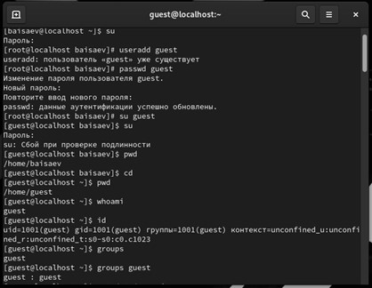

**РОССИЙСКИЙ УНИВЕРСИТЕТ ДРУЖБЫ НАРОДОВ**

**Факультет физико-математических и естественных наук**

**Кафедра прикладной информатики и теории вероятностей**

**ОТЧЕТ**

**ПО ЛАБОРАТОРНОЙ РАБОТЕ №2**

*дисциплина: Основы информационной безопасности*

Студент: Исаев Булат Абубакарович

Студ. Билет: 1132227131

Группа: НПИбд-01-22

**МОСКВА**

2024 г.
# **Цель работы:**
# Получение практических навыков работы в консоли с атрибутами файлов, закрепление теоретических основ дискреционного разграничения доступа в современных системах с открытым кодом на базе ОС Linux1 .
#
**Выполнение работы:**

1. Создаём учётную запись нового пользователя (useradd guest)
1. Задаём для него пароль (passwd guest)
1. Входим в систему от имени пользователя guest (su guest)
1. Определяем директорию, в которой мы находимся (pwd)
1. Уточняем имя нашего пользователя (whoami)
1. Уточняем имя пользователя, группу, а также группы, куда входит пользователь (id)
1. Уточняем группу (groups)

Вышеописанные команды показаны в (рис. 1)

**Рис. 1 –** Добавление пользователя и проверка данных

1. Просмотрите файл /etc/passwd (cat /etc/passwd)

Эта команда показана в (рис. 2)

**Рис. 2 –** Просмотр файла /etc/passwd

1. Определение существующих в системе директорий (mkdir dirtest)

Эта команда показана в (рис. 3)

**Рис. 3 –** Определение существующих в системе директорий

1. ` `Создание в домашней директории поддиректорию dirtest
1. ` `Снятие с директории dirtest все атрибуты (chmod 000 dirtest)
1. ` `Проверка выполнения команды (ls -l)
1. ` `Попытка создать в директории dirtest файл file1 (echo "test" > /home/guest/dirtest/file1)

Нам отказывают в доступе, потому что мы сняли атрибуты

Вышеописанные команды показаны в (рис. 4)

**Рис. 4 –** Создание директории, снятие атрибутов с неё и проверка выполнения команды и попытка создать файл в этой директории

14\. Заполняем таблицу «Установленные права и разрешённые действия»,  выполняя действия от имени владельца директории (файлов),  определим опытным путём, какие операции разрешены, а какие нет. Если операция разрешена, заносим в таблицу знак «+», если не разрешена, знак «-».

**Рис. 5 –** Заполнение таблицы

1 - Создание файла 

2- Удаление файла 

3- Запись в файл 

4- Чтение файла 

5- Смена директории 

6- Просмотр файлов в директории 

7 - Переименование файла 

8- Смена атрибутов файла

**Таблица 1**

Основываясь **таблицей 1** мы определили минимально необходимые права для выполнения операций внутри директории dirtest и заполнили **таблицу 2**. 

Для заполнения последних двух строк опытным путем проверили минимальные права.

**Таблица 2**

**Вывод:**

В ходе выполнения лабораторной работы были получены навыки работы с атрибутами файлов и сведения о разграничении доступ
7

