**РОССИЙСКИЙ УНИВЕРСИТЕТ ДРУЖБЫ НАРОДОВ** 

**Факультет физико-математических и естественных наук Кафедра прикладной информатики и теории вероятностей** 

**ОТЧЕТ ПО**  

*дисциплина: Основы информационной безопасности* 

Студент: Исаев Булат Абубакарович Студ. Билет: 1132227131 

Группа: НПИбд-01-22

**МОСКВА** 2024 г. 

# Generic otions
lang: ru-RU
toc-title: "Содержание"

# Bibliography
bibliography: bib/cite.bib
csl: pandoc/csl/gost-r-7-0-5-2008-numeric.csl

# Pdf output format
toc: true # Table of contents
toc_depth: 2
lof: true # List of figures
fontsize: 12pt
linestretch: 1.5
papersize: a4
documentclass: scrreprt
## I18n
polyglossia-lang:
  name: russian
  options:
	- spelling=modern
	- babelshorthands=true
polyglossia-otherlangs:
  name: english
### Fonts
mainfont: PT Serif
romanfont: PT Serif
sansfont: PT Sans
monofont: PT Mono
mainfontoptions: Ligatures=TeX
romanfontoptions: Ligatures=TeX
sansfontoptions: Ligatures=TeX,Scale=MatchLowercase
monofontoptions: Scale=MatchLowercase,Scale=0.9
## Biblatex
biblatex: true
biblio-style: "gost-numeric"
biblatexoptions:
  - parentracker=true
  - backend=biber
  - hyperref=auto
  - language=auto
  - autolang=other*
  - citestyle=gost-numeric
## Misc options
indent: true
header-includes:
  - \linepenalty=10 # the penalty added to the badness of each line within a paragraph (no associated penalty node) Increasing the value makes tex try to have fewer lines in the paragraph.
  - \interlinepenalty=0 # value of the penalty (node) added after each line of a paragraph.
  - \hyphenpenalty=50 # the penalty for line breaking at an automatically inserted hyphen
  - \exhyphenpenalty=50 # the penalty for line breaking at an explicit hyphen
  - \binoppenalty=700 # the penalty for breaking a line at a binary operator
  - \relpenalty=500 # the penalty for breaking a line at a relation
  - \clubpenalty=150 # extra penalty for breaking after first line of a paragraph
  - \widowpenalty=150 # extra penalty for breaking before last line of a paragraph
  - \displaywidowpenalty=50 # extra penalty for breaking before last line before a display math
  - \brokenpenalty=100 # extra penalty for page breaking after a hyphenated line
  - \predisplaypenalty=10000 # penalty for breaking before a display
  - \postdisplaypenalty=0 # penalty for breaking after a display
  - \floatingpenalty = 20000 # penalty for splitting an insertion (can only be split footnote in standard LaTeX)
  - \raggedbottom # or \flushbottom
  - \usepackage{float} # keep figures where there are in the text
  - \floatplacement{figure}{H} # keep figures where there are in the text
---

Цель работы 

Пройти спец. курс “Основы кибербезопасности” и получить сертификат. 

Выполнение заданий курса Раздел 1: “О курсе” 

Рис. Раздел (1) – Вступление

В этом разделе нам в видео объясняют о чём будет этот курс. 

Раздел 2: “Безопасность в сети” 

(2.1) [“Как работает интернет: базовые сетевые протоколы”](https://stepik.org/lesson/666218/step/1?unit=664207)

Рис. Раздел (2.1) – Вопрос 1 Вопрос: Выберите протокол прикладного уровня 

Ответ: HTTPS 
UPD – транспортного уровня 
TCP – транспортного уровня 
HTTPS – прикладной уровня 
IP – сетевого уровня 

Рис. Раздел (2.1) – Вопрос 2 

Вопрос: На каком уровне работает протокол TCP? 

Ответ: TCP работает на транспортном уровне, который является 4-м уровнем в модели OSI 

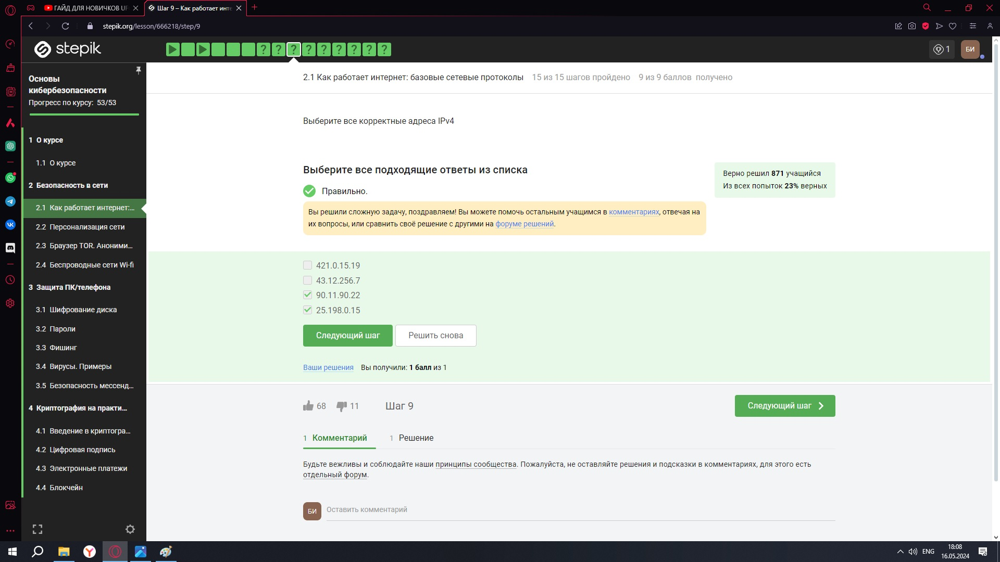

Рис. Раздел (2.1) – Вопрос 3 

Вопрос: Выберите все корректные адреса IPv4 

Ответ: Корректные адреса IPv4 состоят из чисел от 0 до 255 

Рис. Раздел (2.1) – Вопрос 4 

Вопрос: DNS сервер это 

Ответ: DNS сервер - система, переводящая доменные имена в IP-адреса, позволяя пользователям легко находить веб-сайты в интернете. 

Рис. Раздел (2.1) – Вопрос 5 

Вопрос: Выберите корректную последовательность протоколов в модели TCP/IP 

Ответ: В модели TCP/IP, которая является набором сетевых протоколов, используемых для передачи данных в интернете, протоколы организованы в четыре уровня: прикладной - транспортный - сетевой - канальный 

Рис. Раздел (2.1) – Вопрос 6 

Вопрос: Протокол http предполагает 

Ответ: Протокол HTTP предполагает стандартный способ передачи веб-страниц от сервера к клиенту

Рис. Раздел (2.1) – Вопрос 7 

Вопрос: Протокол https состоит из 

Ответ: Протокол HTTPS включает в себя две основные фазы в процессе установления защищенного соединения между клиентом и сервером: 

1. **Фаза рукопожатия:** В этой фазе клиент и сервер обмениваются информацией, необходимой для установления безопасного соединения. 
1. **Фаза передачи данных:** После успешного рукопожатия и установления защищенного канала связи начинается передача зашифрованных данных. 

Рис. Раздел (2.1) – Вопрос 8 Вопрос: Версия протокола TLS определяется 

Ответ: Версия протокола TLS определяется и клиентом, и сервером в процессе “переговоров”. Процесс переговоров -  согласование обоих сторон на общие параметры безопасности, для обеспечения надежного и защищенного соединения. 

Рис. Раздел (2.1) – Вопрос 9 

Вопрос: В фазе “рукопожатия” протокола TLS не предусмотрено 

Ответ: В фазе “рукопожатия” протокола TLS не предусмотрено шифрование 

(2.2) “Персонализация сети”

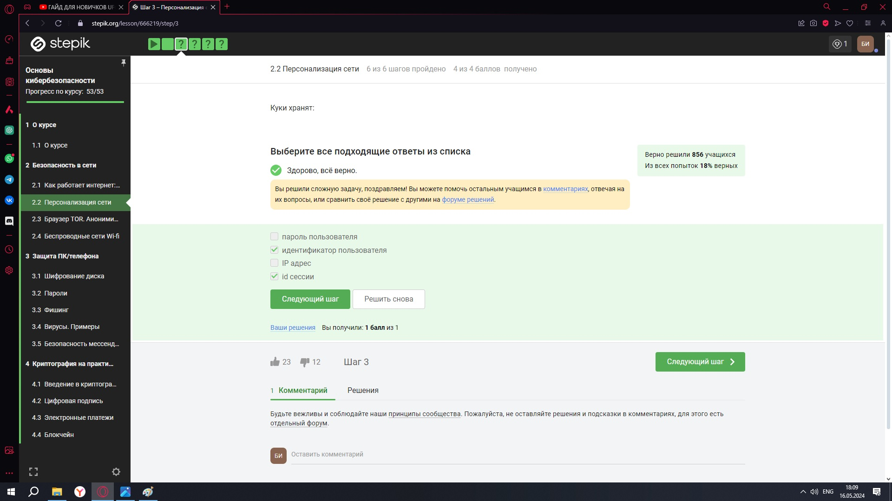

Рис. Раздел (2.2) – Вопрос 1 

Вопрос: Куки хранят: 

Ответ: Куки - это небольшие текстовые файлы, которые веб-сайты могут использовать для хранения информации на компьютере пользователя. IP хранится в базе данных провайдеров интернет-услуг. А пароли пользователей обычно хранятся в базах данных на серверах приложений или веб-сайтов.

Рис. Раздел (2.2) – Вопрос 2 

Вопрос: Куки не используются для 

Ответ: Для улучшения надежности сетевого соединения используются различные технологии и протоколы (TCP, HTTPS) 

Рис. Раздел (2.2) – Вопрос 3 

Вопрос: Куки генерируются 

Ответ: Когда пользователь посещает веб-сайт, сервер может отправить куки в браузер пользователя для сохранения определённой информации. 

Рис. Раздел (2.2) – Вопрос 4 

Вопрос: Сессионные куки хранятся в браузере? 

Ответ: Сессионные куки хранятся в браузере на время пользования веб-сайтом

(2.3) [“Браузер TOR. Анонимизация”](https://stepik.org/lesson/666220/step/1?unit=664209)

Рис. Раздел (2.3) – Вопрос 1 Вопрос: Сколько промежуточных узлов в луковой сети TOR? 

Ответ: В сети TOR всего 3 промежуточных узла 

Рис. Раздел (2.3) – Вопрос 2 

Вопрос: IP-адрес получателя известен 

Ответ: IP-адрес получателя известен только отправителю и выходному узлу 

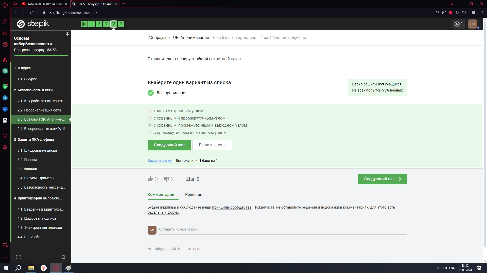

Рис. Раздел (2.3) – Вопрос 3 Вопрос: Отправитель генерирует общий секретный ключ 

Ответ: Отправитель генерирует общий секретный ключ с охранным, промежуточным и выходным ключом.

Рис. Раздел (2.3) – Вопрос 4 

Вопрос: Должен ли получатель использовать браузер Tor (или другой браузер, основанный на луковой маршрутизации) для успешного получения пакетов? 

Ответ: Эти браузеры полезны для обеспечения анонимности в Интернете, а не для успешного получения пакетов. 

(2.4) [“Беспроводные сети Wi-fi”](https://stepik.org/lesson/666221/step/1?unit=664210)

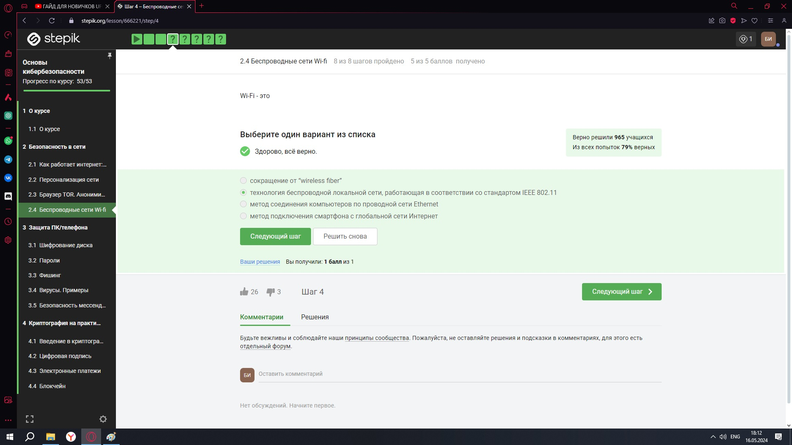

Рис. Раздел (2.4) – Вопрос 1 

Вопрос: Wi-Fi это 

Ответ: Wi-Fi - это беспроводная технология, которая позволяет электронным устройствам подключаться к интернету или обмениваться данными через радиоволны без физического подключения к проводной сети. 

Рис. Раздел (2.4) – Вопрос 2 Вопрос: На каком уровне работает протокол WiFi?

Ответ: WiFi протокол работает на канальном уровне 

Рис. Раздел (2.4) – Вопрос 3 

Вопрос: Небезопасный метод обеспечения шифрования и аутентификации в сети Wi-Fi Ответ: WEP считается небезопасным для шифрования и аутентификации в Wi-Fi 

Рис. Раздел (2.4) – Вопрос 4 

Вопрос: Данные между хостом сети (компьютером или смартфоном) и роутером Ответ: Данные между хостом сети (компьютером или смартфоном) и роутером 

` `передаются в зашифрованном виде после аутентификации устройств 

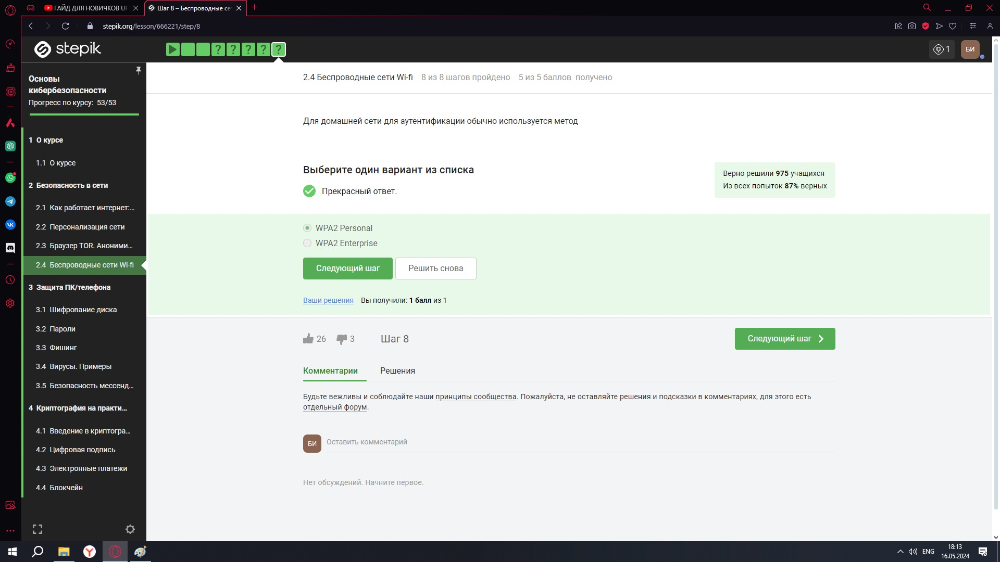

Рис. Раздел (2.4) – Вопрос 5 

Вопрос: Для домашней сети для аутентификации обычно используется метод 

Ответ: Для домашней сети для аутентификации обычно используется метод WPA2 Personal 

Раздел 3: “Защита ПК/телефона” 

(3.1) [“Шифрование диска”](https://stepik.org/lesson/666222/step/1?unit=664211) 

Рис. Раздел (3.1) – Вопрос 1 Вопрос: Можно ли зашифровать загрузочный сектор диска Ответ: Да, можно зашифровать загрузочный сектор диска 

Рис. Раздел (3.1) – Вопрос 3 

Вопрос: Шифрование диска основано на

Ответ: Шифрование диска основано на симметричном шифровании 

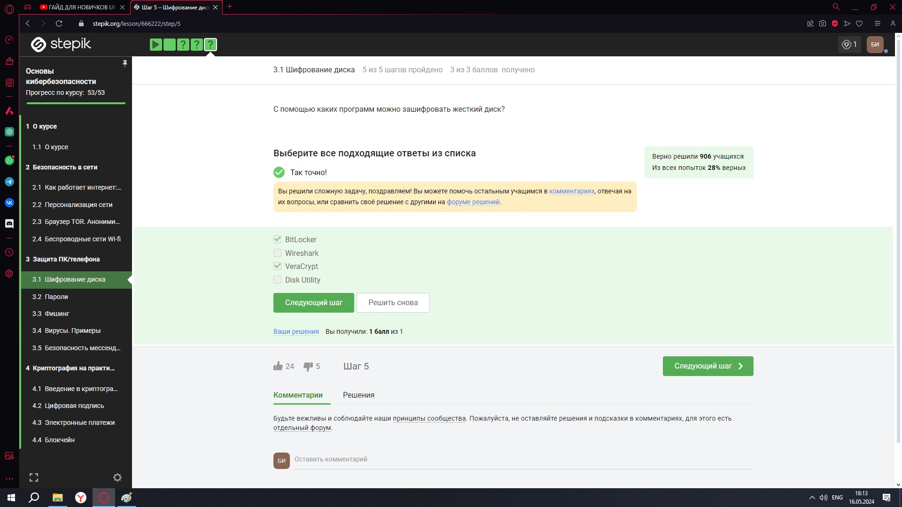

Рис. Раздел (3.1) – Вопрос 3 

Вопрос: С помощью каких программ можно зашифровать жесткий диск? Ответ: С помощью BitLocker и VeraCrypt можно зашифровать жесткий диск 

(3.2) [“Пароли”](https://stepik.org/lesson/666222/step/1?unit=664211) 

Рис. Раздел (3.2) – Вопрос 1 

Вопрос: Какие пароли можно отнести с стойким? 

Ответ: UQr9@j4!S$, потому что тут используется сложный набор символов 

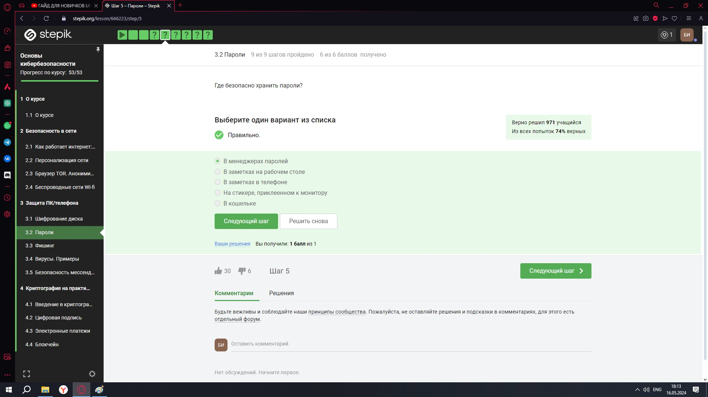

Рис. Раздел (3.2) – Вопрос 2 

Вопрос: Где безопасно хранить пароли? 

Ответ: Безопасно хранить пароли безопасно в менеджерах паролей 

Рис. Раздел (3.2) – Вопрос 3 

Вопрос: Зачем нужна капча? 

Ответ: Капча нужна для защиты от автоматизированных атак, направленных на получение несанкционированного доступа 

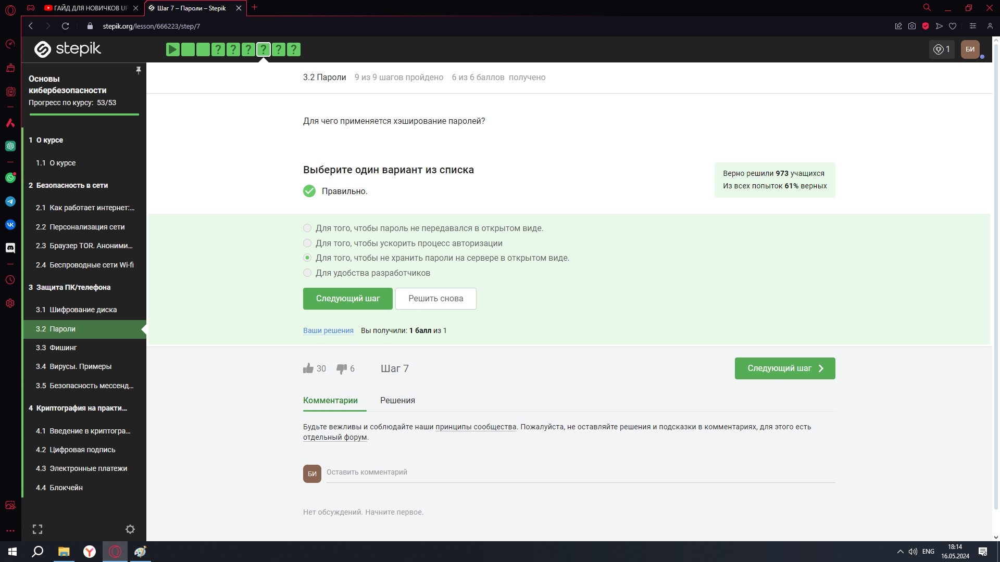

Рис. Раздел (3.2) – Вопрос 4 Вопрос: Для чего применяется хэширование паролей? 

Ответ: хэширование паролей применяется для того, чтобы не хранить пароли на сервере в открытом виде. 

Рис. Раздел (3.2) – Вопрос 5 

Вопрос: Поможет ли соль для улучшения стойкости паролей к атаке перебором, если злоумышленник получил доступ к серверу? 

Ответ: Нет, не поможет 

Рис. Раздел (3.2) – Вопрос 6 

Вопрос: Какие меры защищают от утечек данных атакой перебором? Ответ: Всё перечисленное на слайде является отличной защитой 

(3.3) [“Фишинг”](https://stepik.org/lesson/666222/step/1?unit=664211) 

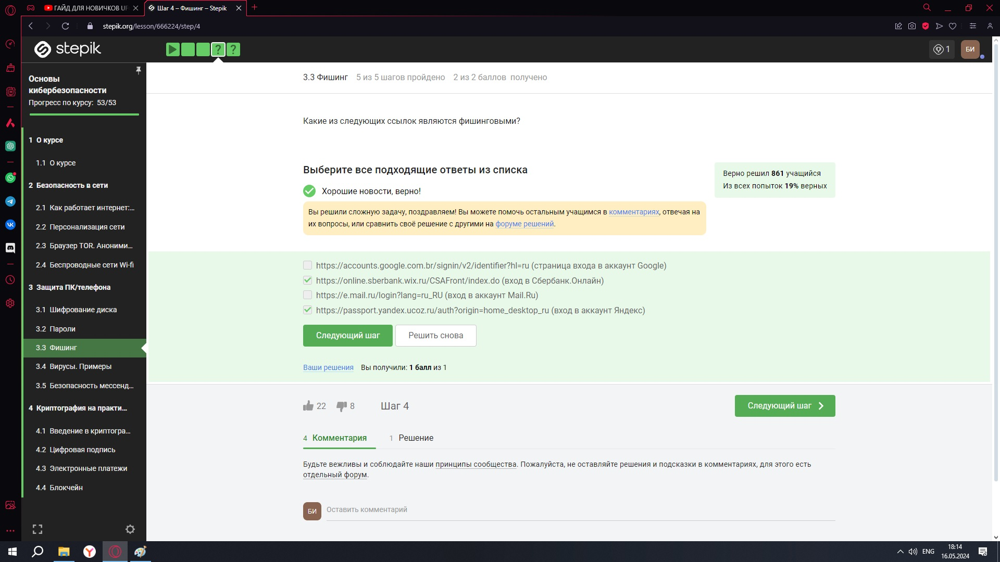

Рис. Раздел (3.3) – Вопрос 1 Вопрос: Какие из следующих ссылок являются фишинговыми? 

Ответ: Фишинговая ссылка — это мошенническая ссылка, которая выглядит достоверно, но на самом деле используется для кражи личных данных пользователя. Тут подходят сайты Сбербанка (.wix лишняя) и Яндекса (.ucoz лишняя) 

Рис. Раздел (3.3) – Вопрос 2 

Вопрос: Может ли фишинговый имейл прийти от знакомого адреса?

Ответ: Может, потому что они маскируются под известные пользователям сайты и почты 

(3.4) [“Вирусы. ](https://stepik.org/lesson/666222/step/1?unit=664211)Примеры” 

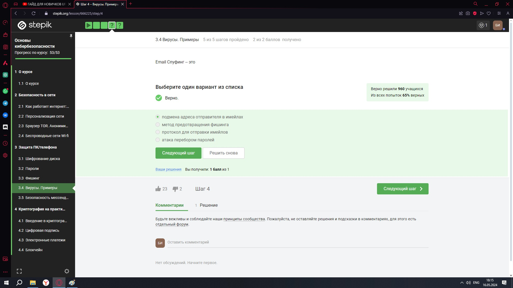

Рис. Раздел (3.4) – Вопрос 1 Вопрос: Email Спуфинг - это 

Ответ: Email Спуфинг - это подмена адреса отправителя в имейлах 

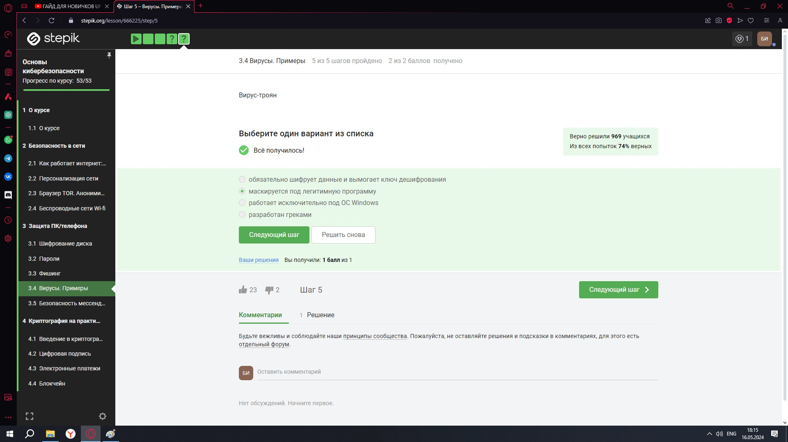

Рис. Раздел (3.4) – Вопрос 2 

Вопрос: Вирус-троян 

Ответ: Он маскируется под легитимную программу или игры, чтобы взломать компьютер или украсть данные 

(3.5) “Безопасность мессенджеров” 

Рис. Раздел (3.5) – Вопрос 1 

Вопрос: На каком этапе формируется ключ шифрования в протоколе мессенджеров Signal? 

Ответ: Ключ шифрования в протоколе мессенджеров Signal формируется при генерации первого сообщения стороной-отправителем 

Вопрос: Суть сквозного шифрования состоит в том, что 

Ответ: Суть сквозного шифрования состоит в том, что сообщения передаются по узлам связи (серверам) в зашифрованном виде 

Раздел 4: “Криптография на практике” 

`  `(4.1) [“Введение в криптографию”](https://stepik.org/lesson/666227/step/1?unit=664216) 

Рис. Раздел (4.1) – Вопрос 1 Вопрос: В асимметричных криптографических примитивах Ответ: Обе стороны имеют пару ключей 

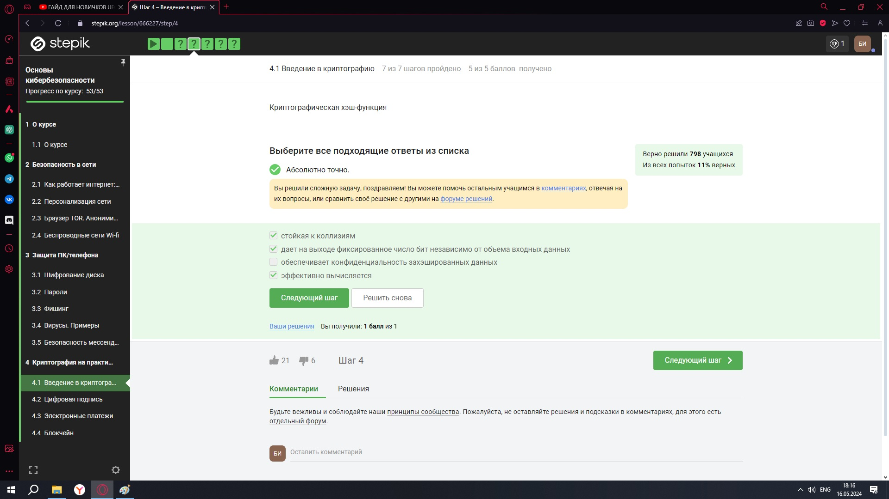

Рис. Раздел (4.1) – Вопрос 2 Вопрос: Криптографическая хэш-функция 

Ответ: Всё верно, кроме пункта “обеспечивает конфиденциальность захэшированных данных” 

Вопрос: К алгоритмам цифровой подписи относятся 

Ответ: RSA, ECDSA и ГОСТ Р 34.10-2012. SHA2— это семейство криптографических хеш- функций, а AES - это алгоритм симметричного шифрования. 

Рис. Раздел (4.1) – Вопрос 4 

Вопрос: Код аутентификации сообщения относится к 

Ответ: Код аутентификации сообщения относится к симметричным примитивам 

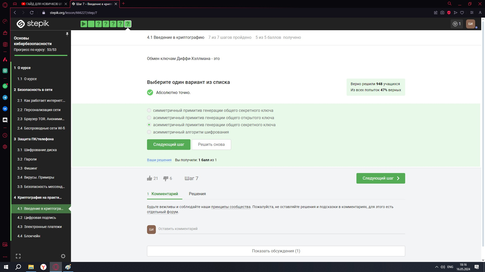

Рис. Раздел (4.1) – Вопрос 5 Вопрос: Обмен ключам Диффи-Хэллмана - это 

Ответ: Обмен ключам Диффи-Хэллмана – это асимметричный примитив генерации общего секретного ключа 

(4.2) [“Цифровая ](https://stepik.org/lesson/666227/step/1?unit=664216)подпись” 

Рис. Раздел (4.2) – Вопрос 1 

Вопрос: Протокол электронной цифровой подписи относится к

Ответ: Он относится к протоколам с публичным (или открытым) ключом 

Рис. Раздел (4.2) – Вопрос 3 

Вопрос: Алгоритм верификации электронной цифровой подписи требует на вход Ответ: Этот алгоритм вход требует подпись, открытый ключ, сообщение 

Рис. Раздел (4.2) – Вопрос 3 

Вопрос: Электронная цифровая подпись не обеспечивает 

Ответ: Электронная цифровая подпись не может обеспечить конфиденциальность 

Рис. Раздел (4.2) – Вопрос 4 

Вопрос: Какой тип сертификата электронной подписи понадобится для отправки налоговой отчетности в ФНС? 

Ответ: ФНС требует сертификат электронной подписи с усиленной квалификацией 

Рис. Раздел (4.2) – Вопрос 6 

Вопрос: В какой организации вы можете получить квалифицированный сертификат ключа проверки электронной подписи? 

Ответ: Сертификаты ключа проверки электронной подписи выдаются в сертификационном центре 

(4.3) “Электронные платежи” 

Рис. Раздел (4.3) – Вопрос 1 Вопрос: Выберите из списка все платежные системы. Ответ: МИР и MasterCard являются платежными системами 

Рис. Раздел (4.3) – Вопрос 2 Вопрос: Примером многофакторной аутентификации является 

Ответ: К многофакторной аутентификации относятся: проверка пароля, код в sms сообщении и отпечаток пальца 

Рис. Раздел (4.3) – Вопрос 3 

Вопрос: При онлайн платежах сегодня используется 

Ответ: Онлайн платежи используют многофакторную аутентификацию покупателя перед банком-эмитентом 

` `(4.4) “Блокчейн” 

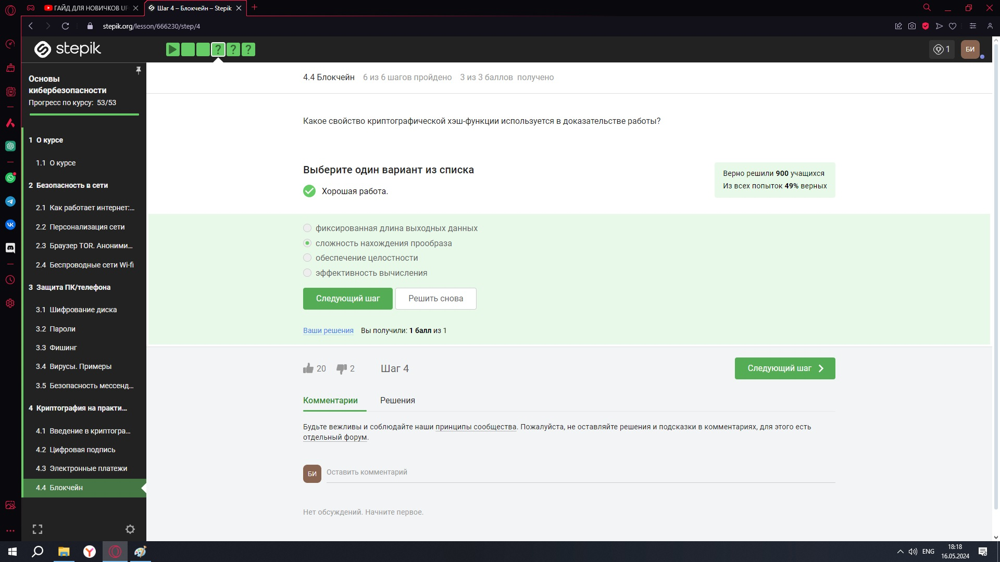

Рис. Раздел (4.4) – Вопрос 1 

Вопрос: Какое свойство криптографической хэш-функции используется в доказательстве работы? 

Ответ: Используется сложность нахождения прообраза 

Рис. Раздел (4.4) – Вопрос 2 

Вопрос: Консенсус в некоторых системах блокчейн обладает свойствами Ответ: Обладает всеми перечисленными свойствами 

Рис. Раздел (4.4) – Вопрос 4 

Вопрос: Секретные ключи какого криптографического примитива хранят участники блокчейна? 

Ответ: Участники блокчейна хранят секретные ключи, которые используются для цифровой подписи 

Раздел 5: “Сертификат” 

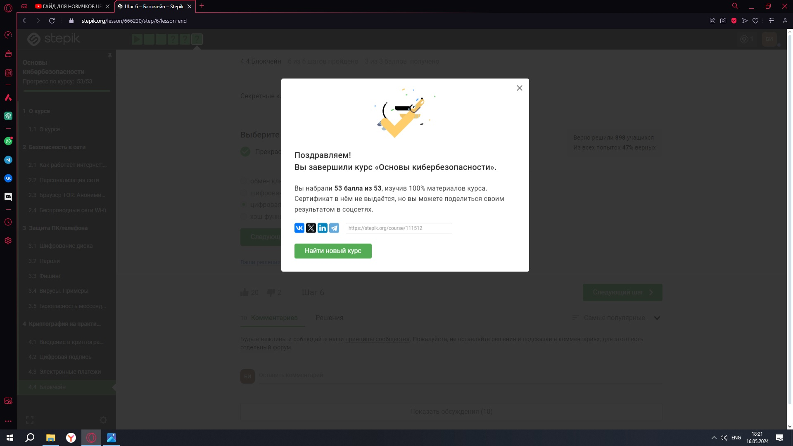

Рис. Раздел (5) - Сертификат 

Вывод 

В  ходе  прохождения  внешних  курсов  были  получены  навыки  о “Безопасности в сети”, “Защите ПК/телефона” и “Криптографии”. 

Ссылка на видео-отчёт: https://youtube.com/playlist?list=PLee3XNDPQRkoa1gJHQ5VvW_OHQRDQSM-V&feature=shared

