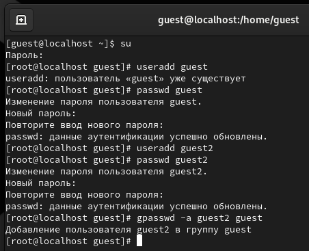
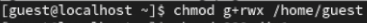

 

Лабораторная работа №3

Дискреционное разграничение прав в Linux.
Два пользователя

**Исаев Булат Абубакарович**

**Студ. Билет: 1132227131**

**Группа: НПИбд-01-22**

 

  
**Рис. 1 –** Создание второго пользователя и добавление в группу guest

 

**Рис. 2 –** Просмотр групп обоих пользователей

 

**Рис. 3 –** Регистрация пользователя guest2 в группе guest

 

**Рис. 4 –** Изменение прав директорий

 

**Рис. 5 –** Заполнение таблицы

 

Вывод

В ходе выполнения работы, мы смогли приобрести

практические навыки работы в консоли с атрибутами

файлов для групп пользователей.

