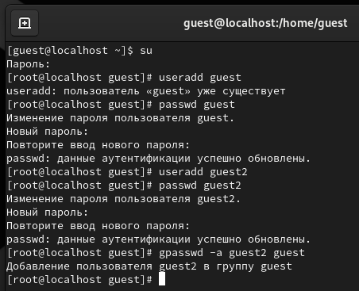
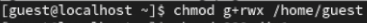
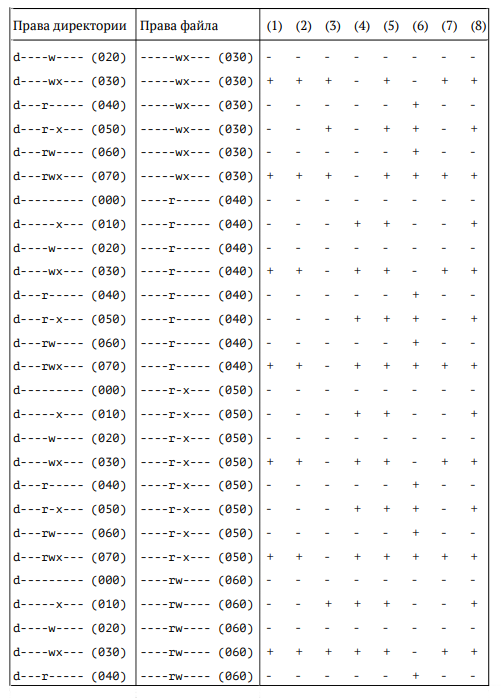
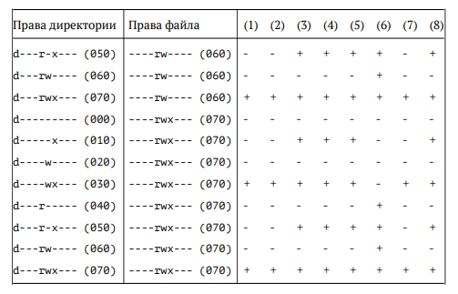

**РОССИЙСКИЙ УНИВЕРСИТЕТ ДРУЖБЫ НАРОДОВ**

**Факультет физико-математических и естественных наук**

**Кафедра прикладной информатики и теории вероятностей**

**ОТЧЕТ**

**ПО ЛАБОРАТОРНОЙ РАБОТЕ №3**

*дисциплина: Основы информационной безопасности*

Студент: Исаев Булат Абубакарович

Студ. Билет: 1132227131

Группа: НПИбд-01-22

**МОСКВА**

2024 г.
# **Цель работы:**
# Получение практических навыков работы в консоли с атрибутами файлов для групп пользователей.
#
**Выполнение работы:**

1. Cоздаём учётную запись пользователя guest (используя учётную запись администратора) (useradd guest)
1. Задаём для него пароль (passwd guest)
1. Создаём второго пользователя guest2 (useradd guest2)
1. Добавляем пользователя guest2 в группу guest (gpasswd -a guest2 guest)

Вышеописанные команды показаны в (рис. 1)

**Рис. 1 –** Создание второго пользователя и добавление в группу guest

1. Входим в учётные записи ‘guest’ и ‘guest2’ в разных консолях (su guest) (su guest2)
1. Для обоих пользователей определяем директорию, в которой находимся. (pwd)
1. Уточняем имя пользователя, его группу, кто входит в неё и к каким группам принадлежит он сам. 
1. Сравниваем выводы команды groups (id –G) и (id –Gn).
1. Определяем в какие группы входят пользователи guest и guest2 (groups guest) (groups guest2). 

Вышеописанные команды показаны в (рис. 2)

**Рис. 2 –** Просмотр групп обоих пользователей

1. ` `Сравниваем полученную информацию с содержимым файла /etc/group. (cat /etc/group)
1. ` `От имени пользователя guest2 выполним регистрацию пользователя guest2 в группе guest (newgrp guest)

Вышеописанные команды показаны в (рис. 3)

**Рис. 3 –** Регистрация пользователя guest2 в группе guest

1. ` `От имени пользователя guest изменяем права директории /home/guest, разрешив все действия для пользователей группы (chmod g+rwx /home/guest)

   И также от имени пользователя guest снимаем с директории /home/guest/dirtest все атрибуты (chmod 000 dirtest)

   Проверяем правильность снятия атрибутов 

   Вышеописанные команды показаны в (рис. 4) 
   

**Рис. 4 –** Изменение прав директорий

1. Меняя атрибуты у директории dir1 и файла file1 от имени пользователя guest и делая проверку от пользователя guest2, заполняем **таблицу 1**, определяем какие операции разрешены, а какие нет. 

   Если операция разрешена «+», а если не разрешена, знак «-». 

   На основании заполненной таблицы определяем минимально необходимые права для выполнения пользователем guest2 операций внутри директории dir1 и заполняем **таблицу 1**

**Рис. 5 –** Заполнение таблицы

1 - Создание файла 

2- Удаление файла 

3- Запись в файл 

4- Чтение файла 

5- Смена директории 

6- Просмотр файлов в директории 

7 - Переименование файла 

8- Смена атрибутов файла

**Таблица 1**

Основываясь **таблицей 1** мы определили минимально необходимые права для выполнения пользователем guest2 операций внутри директории dirtest и заполнили **таблицу 2**. 

Для заполнения последних двух строк опытным путем проверили минимальные права.

**Таблица 2**

В предыдущий раз мы присваивали права владельцу, а в этот раз группе.

**Вывод:**

В ходе выполнения работы, мы смогли приобрести практические навыки работы в консоли с атрибутами файлов для групп пользователей.
7
