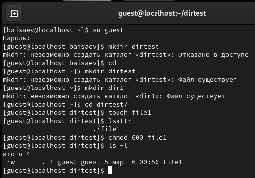
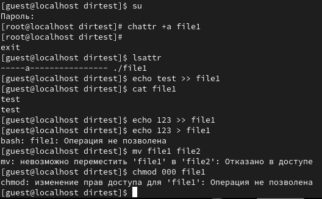
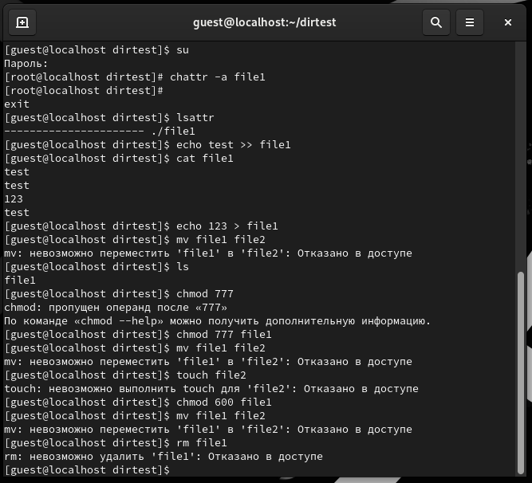
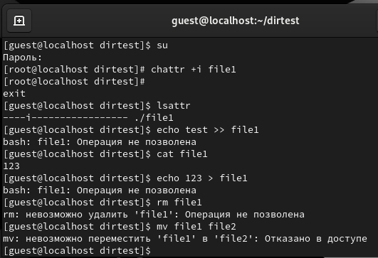

 

Лабораторная работа №4

Дискреционное разграничение прав в Linux.

Расширенные атрибуты

**Исаев Булат Абубакарович**

**Студ. Билет: 1132227131**

**Группа: НПИбд-01-22**

 

 
**Рис. 1** – Права доступа
 

 

 
**Рис. 2** – Атрибут -a
 

 

 
**Рис. 3 –** Атрибут -a снят
 

 

 
**Рис. 4 –** Атрибут -i
 

 

Вывод

Получены практические навыки работы в консоли с расширенными атрибутами файлов

