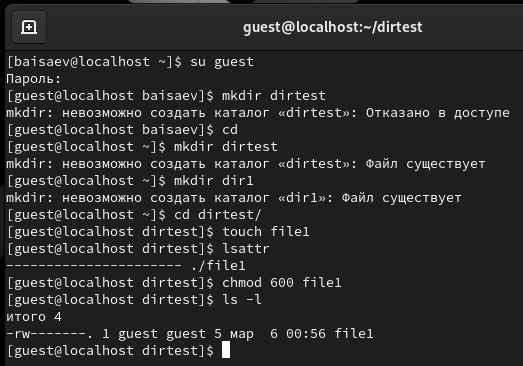
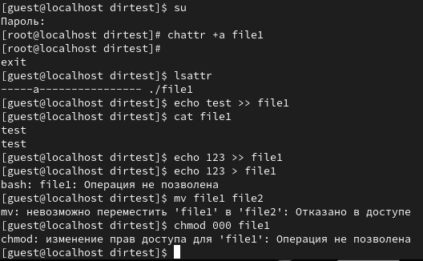
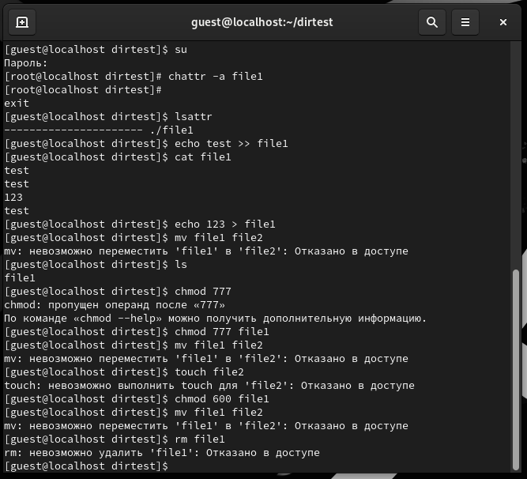
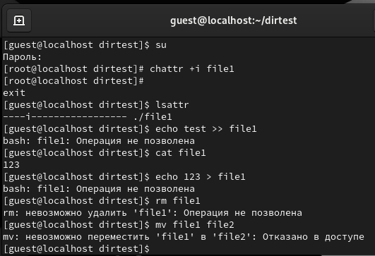

**РОССИЙСКИЙ УНИВЕРСИТЕТ ДРУЖБЫ НАРОДОВ**

**Факультет физико-математических и естественных наук**

**Кафедра прикладной информатики и теории вероятностей**

**ОТЧЕТ**

**ПО ЛАБОРАТОРНОЙ РАБОТЕ №4**

*дисциплина: Основы информационной безопасности*

Студент: Исаев Булат Абубакарович

Студ. Билет: 1132227131

Группа: НПИбд-01-22

**МОСКВА**

2024 г.
# **Цель работы:**
Получение практических навыков работы в консоли с расширенными атрибутами файлов.
#
**Выполнение работы:**

1. От имени пользователя guest определите расширенные атрибуты файла

/home/guest/dir1/file1 командой lsattr /home/guest/dir1/file1

1. Установите командой chmod 600 file1 на файл file1 права, разрешающие чтение и запись для владельца файла.

Вышеописанные команды показаны в (рис. 1)

**Рис. 1 –** Права доступа

1. Попробуйте установить на файл /home/guest/dir1/file1 расширенный атрибут a от имени пользователя guest: chattr +a /home/guest/dir1/file1

Получаем отказ,для смены расширенных атрибутов недостаточно прав.

1. Зайдите на третью консоль с правами администратора либо повысьте свои права с помощью команды su. Попробуйте установить расширенный атрибут a на файл /home/guest/dir1/file1 от имени суперпользователя: chattr +a /home/guest/dir1/file1

Команда выполнилась от имени суперпользователя

1. От пользователя guest проверьте правильность установления атрибута: lsattr /home/guest/dir1/file1 Атрибут–а установлен.
1. Выполните дозапись в файл file1 слова «test» командой echo “test” »

/home/guest/dir1/file1

Дозапись выполнена.

После этого выполните чтение файла file1 командой cat /home/guest/dir1/file1 Файл содержит строку “test”.

1. Попробуйтеудалитьфайлfile1либостеретьимеющуюсявнёминформацию командой echo “abcd” > /home/guest/dirl/file1 Попробуйте переименовать файл.

Перезаписать файл не удается, удалить или переименовать тоже.

1. Попробуйте с помощью команды chmod 000 file1 установить на файл file1 права, например, запрещающие чтение и запись для владельца файла.Удалось ли вам успешно выполнить указанные команды?

Команда изменения прав также не выполняется.

**Рис. 2 –** Атрибут -a

1. Снимите расширенный атрибут a с файла /home/guest/dirl/file1 от имени суперпользователя командой chattr -a /home/guest/dir1/file1

Атрибут снят.

Повторите операции, которые вам ранее не удавалось выполнить. Ваши наблюдения занесите в отчёт.

После снятия атрибута –а стало возможным переписать файл, удалить или переименовать его, а также сменить права.Атрибут–а позволяеттолько дозаписывать файл.

**Рис. 3 –** Атрибут -a снят

1. Повторите ваши действия по шагам, заменив атрибут «a» атрибутом «i». Удалосьливамдозаписатьинформациювфайл?Вашинаблюдениязанесите в отчёт.

Атрибут–i запрещает любое изменеие файла: дозапись, переименование, удаление, смену атрибутов.

**Рис. 4 –** Атрибут -i

#
# **Выводы**
Получены практические навыки работы в консоли с расширенными атрибутами файлов

# **Выводы**
Изучили механизмы изменения идентификаторов, применения SetUID- и Stickyбитов. Получили практические навыки работы в консоли с дополнительными атрибутами. Также мы рассмотрели работу механизма смены идентификатора процессов пользователей и влияние бита Sticky на запись и удаление файлов.

**Список литературы**

1. [КОМАНДА CHATTR В LINUX](https://losst.ru/neizmenyaemye-fajly-v-linux)
1. [chattr](https://en.wikipedia.org/wiki/Chattr)