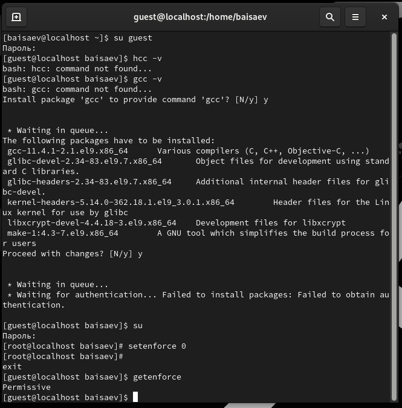
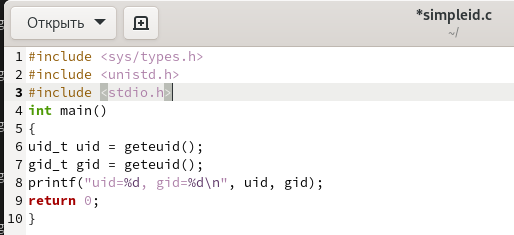
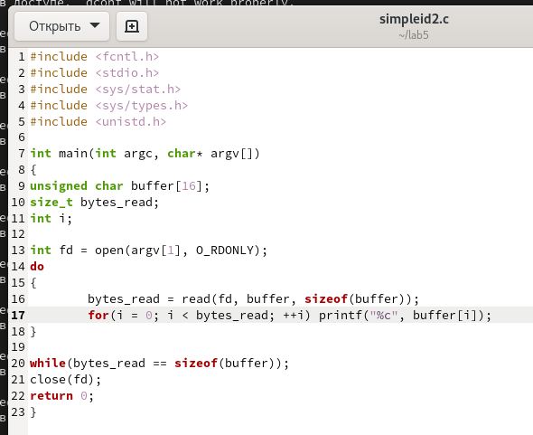
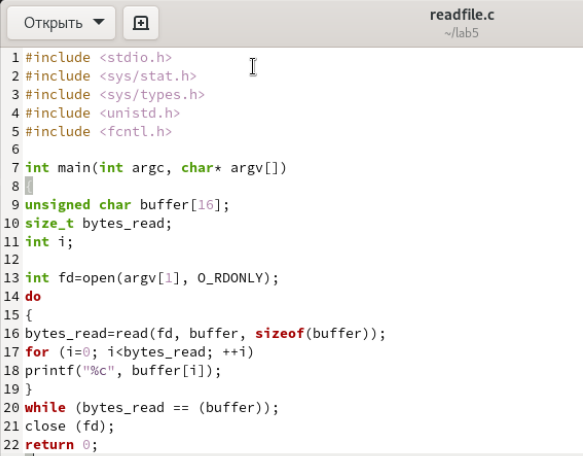
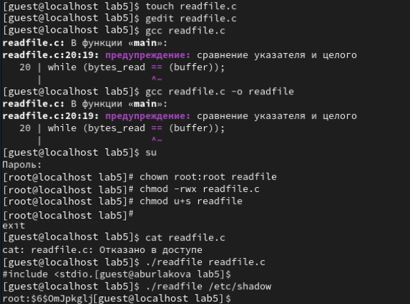

 

Лабораторная работа №5

Дискреционное разграничение прав в Linux.

Исследование влияния дополнительных атрибутов

**Исаев Булат Абубакарович**
**Студ. Билет: 1132227131**
**Группа: НПИбд-01-22**

 

**Рис. 1 –** Подготовка к работе

 

**Рис. 2 –** Программа simpleid

 

**Рис. 3 –** Результат программы simpleid

 

**Рис. 4 –** Программа simpleid2

 

**Рис. 5 –** Результат программы simpleid2

 

**Рис. 6 –** Программа readfile

 

**Рис. 7 –** Результат программы readfile

 

Вывод

Изучили механизмы изменения идентификаторов, применения SetUID- и

Stickyбитов. Получили практические навыки работы в консоли с дополнительными

атрибутами. Также мы рассмотрели работу механизма смены идентификатора

процессов пользователей и влияние бита Sticky на запись и удаление файлов.