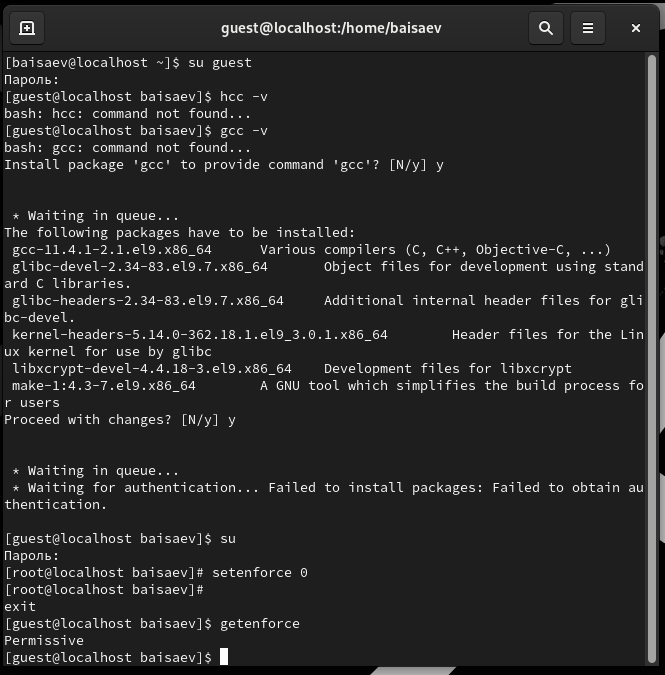
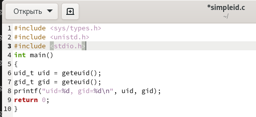
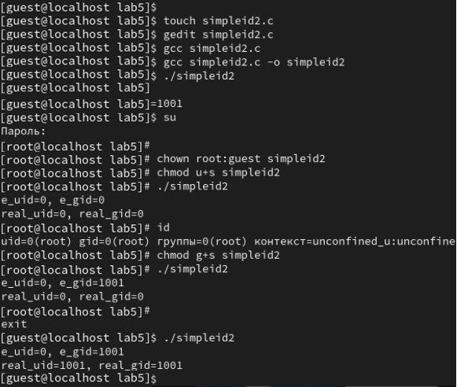
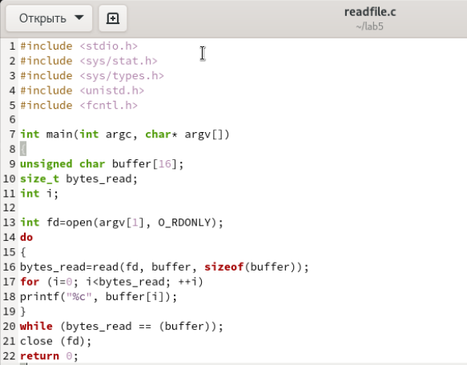

**РОССИЙСКИЙ УНИВЕРСИТЕТ ДРУЖБЫ НАРОДОВ**

**Факультет физико-математических и естественных наук**

**Кафедра прикладной информатики и теории вероятностей**

**ОТЧЕТ**

**ПО ЛАБОРАТОРНОЙ РАБОТЕ №5**

*дисциплина: Основы информационной безопасности*

Студент: Исаев Булат Абубакарович

Студ. Билет: 1132227131

Группа: НПИбд-01-22

**МОСКВА**

2024 г.
# **Цель работы:**
# Изучение механизмов изменения идентификаторов, применения SetUID и Stickyбитов. Получение практических навыков работы в консоли с дополнительными атрибутами. Рассмотрение работы механизма смены идентификатора процессов пользователей, а также влияние бита Sticky на запись и удаление файлов.
#
**Выполнение работы:**

1. Для выполнения части заданий требуются средства разработки приложений. Проверяем наличие установленного компилятора gcc (gcc -v)
1. Чтобы система защиты SELinux не мешала выполнению заданий работы, отключили систему запретов до очередной перезагрузки системы. (setenforce 0)
1. Команда getenforce вывела Permissive (getenforce)

Вышеописанные команды показаны в (рис. 1)

**Рис. 1 –** Подготовка к работе
## ***2.2 Изучение механики SetUID***

1. Входим в систему от имени пользователя guest. (su guest)
1. Пишем программу simpleid.c. 

   (touch simpleid.c)

   (gedit simpleid.c)

Вышеописанные команды показаны в (рис. 2)

**Рис. 2 –** Программа simpleid

1. Скомпилируем программу (gcc simpleid.c -o simpleid)
1. Выполняем программу simpleid (./simpleid)
1. Выполняем системную программу id (id). 

uid и gid совпадает в обеих программах

Вышеописанные команды показаны в (рис. 3)

**Рис. 3 –** Результат программы simpleid

1. ` `Усложняем программу, добавив вывод действительных идентификаторов.

**Рис. 4 –** Программа simpleid2

1. Скомпилируем и запустили simpleid2.c 

   (gcc simpleid2.c -o simpleid2)

(./simpleid2)

1. От имени суперпользователя выполняем команды:

(chown root:guest /home/guest/simpleid2) 

(chmod u+s /home/guest/simpleid2)

1. Повышаем права до суперпользователя (su)
1. Выполняем проверку правильности установки новых атрибутов и смены владельца файла simpleid2 (ls -l simpleid2)
1. Запускаем simpleid2 и id (./simpleid2 id)

Результат выполнения программ теперь немного отличается

1. Проделаем тоже самое относительно SetGID-бита.

`             `

`     `**Рис. 5 –** Результат программы simpleid2

1. Напишем программу readfile.c

   

**Рис. 6 –** Программа readfile

1. Откомпилируем её. (gcc readfile.c -o readfile)
1. Сменимвладельца у файла readfile.c и изменим права так, чтобы только суперпользователь (root) мог прочитать его, a guest не мог.

(chown root:guest /home/guest/readfile.c)

(chmod 700 /home/guest/readfile.c)

1. Проверим, что пользователь guest не может прочитать файл readfile.c.
1. Сменим у программы readfile владельца и установили SetU’D-бит.
1. Проверим, может ли программа readfile прочитать файл readfile.c
1. Проверим, может ли программа readfile прочитать файл /etc/shadow

**Рис.7 -** Результат программы readfile
## ***2.3 Исследование Sticky-бита***
1. Выясним, установлен ли атрибут Sticky на директории /tmp: (ls -l / | grep tmp)
1. От имени пользователя guest создаём файл file01.txt в директории /tmp со словом test: 

   (echo "test" > /tmp/file01.txt)

1. Просмотрим атрибуты у только что созданного файла и разрешили чтение и запись для категории пользователей «все остальные»:

   (ls -l /tmp/file01.txt chmod o+rw /tmp/file01.txt)

(ls -l /tmp/file01.txt)

Первоначально все группы имели право на чтение, а запись могли осуществлять все, кроме «остальных пользователей».

1. От пользователя (не являющегося владельцем) попробуем прочитать файл /file01.txt: (cat /file01.txt)
1. От пользователя попробовали дозаписать в файл /file01.txt слово test3 командой: 

   (echo "test2" >> /file01.txt)

1. Проверим содержимое файла командой: (cat /file01.txt)

В файле теперь записано:

Test

Test2

1. От пользователя попробуем записать в файл /tmp/file01.txt слово test4, стерев при этом всю имеющуюся в файле информацию командой.Для этого воспользовалась командой echo “test3” > /tmp/file01.txt
1. Проверили содержимое файла командой

cat /tmp/file01.txt

1. От пользователя попробуем удалить файл /tmp/file01.txt командой rm /tmp/file01.txt, однако получила отказ.
1. От суперпользователя командой выполним команду, снимающую атрибут t (Sticky-бит) с директории /tmp:

chmod -t /tmp

Покинули режим суперпользователя командой exit.

1. От пользователя проверим, что атрибута t у директории /tmp нет:

ls -l / | grep tmp

1. Повторим предыдущие шаги. Получилось удалить файл
1. Удалось удалить файл от имени пользователя, не являющегося его владельцем.
1. Повысим свои права до суперпользователя и вернули атрибут t на директорию /tmp :

su chmod +t /tmp exit

# **Выводы**
Изучили механизмы изменения идентификаторов, применения SetUID- и Stickyбитов. Получили практические навыки работы в консоли с дополнительными атрибутами. Также мы рассмотрели работу механизма смены идентификатора процессов пользователей и влияние бита Sticky на запись и удаление файлов.

**Список литературы**

1. [КОМАНДА CHATTR В LINUX](https://losst.ru/neizmenyaemye-fajly-v-linux)
1. [chattr](https://en.wikipedia.org/wiki/Chattr)

7

