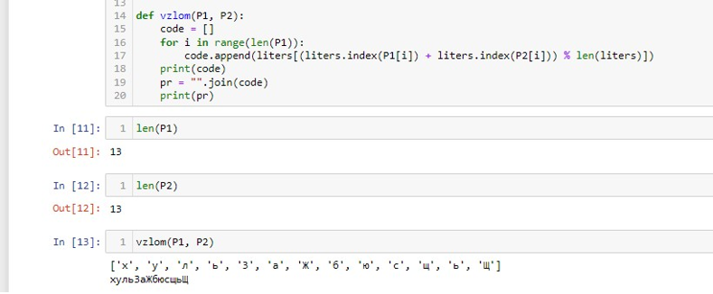
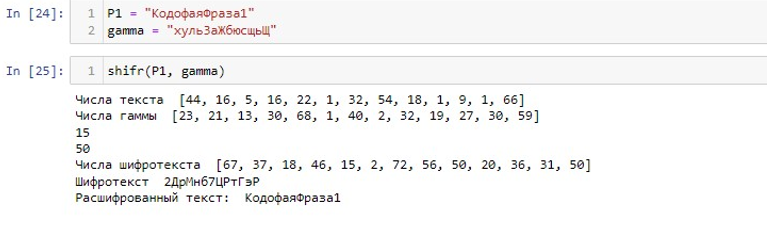

**РОССИЙСКИЙ УНИВЕРСИТЕТ ДРУЖБЫ НАРОДОВ** 

**Факультет физико-математических и естественных наук Кафедра прикладной информатики и теории вероятностей** 

**ОТЧЕТ** 

**ПО ЛАБОРАТОРНОЙ РАБОТЕ №8**                     *дисциплина: Основы информационной безопасности* 

Студент: Исаев Булат Абубакарович Студ. Билет: 1132227131 

Группа: НПИбд-01-22

**МОСКВА** 

2024 г.

**Содержание**

**1  Цель работы  4**

**2  Теоретические сведения  5**

1. Шифр гаммирования  . . . . . . . . . . . . . . . . . . . . . . . .  5
1. Идея взлома  . . . . . . . . . . . . . . . . . . . . . . . . . . . . .  6

**3  Выполнение работы  8**

1. Реализация взломщика, шифратора и дешифратора на Python . .  8
1. Контрольный пример . . . . . . . . . . . . . . . . . . . . . . . .  11

**4  Выводы  12**

**Список литературы  13**

**List of Figures**

1. Работа алгоритма взлома ключа  . . . . . . . . . . . . . . . . . .  11
1. Работа алгоритма шифрования и дешивровки . . . . . . . . . . . 11

**1  Цель работы**

Освоить  на  практике  применение  режима  однократного  гаммирования  на  примере кодирования различных исходных текстов одним ключом.

**2  Теоретические сведения**

1. **Шифр гаммирования** 

Гаммирование  –  это  наложение  (снятие)  на  открытые  (зашифрованные)  данные криптографической  гаммы,  т.е.  последовательности  элементов  данных, вырабатываемыхспомощьюнекоторогокриптографическогоалгоритма,дляполучения зашифрованных (открытых) данных.

Принцип  шифрования  гаммированием  заключается  в  генерации  гаммы  шифра  с помощью датчика псевдослучайных чисел и наложении полученной гаммы шифра на открытые данные обратимым образом (например, используя операцию сложения по модулю 2). Процесс дешифрования сводится к повторной генерации гаммы шифра при известном ключе и наложении такой же гаммы на зашифрованные данные. Полученный зашифрованный текст является достаточно трудным для раскрытия в том случае, если гамма шифра не содержит повторяющихся битовых последовательностей и изменяется случайным образом для каждого шифруемого слова. Если период гаммы превышает длину  всего  зашифрованного  текста  и  неизвестна  никакая  часть  исходного  текста,то шифр можно раскрыть только прямым перебором (подбором ключа). В этом случае криптостойкость определяется размером ключа.

Метод гаммирования становится бессильным, если известен фрагмент исходного текста и соответствующая ему шифрограмма. В этом случае простым вычитанием по модулю 2 получается отрезок псевдослучайной последовательности и по нему восстанавливается вся эта последовательность.

Метод гаммирования с обратной связью заключается в том,что для получения сегмента гаммы используется контрольная сумма определенного участка шифруемых данных. Например, если рассматривать гамму шифра как объединение непересекающихся множеств H(j),то процесс шифрования можно пердставить следующими шагами:

1. Генерация  сегмента  гаммы  H(1)  и  наложение  его  на  соответствующий  участок шифруемых данных.
1. Подсчет контрольной суммы участка, соответствующего сегменту гаммы H(1).
1. Генерация  с  учетом  контрольной  суммы  уже  зашифрованного  участка  данных следующего сегмента гамм H(2).
4. Подсчет контрольной суммы участка данных, соответствующего сегменту данных H(2) и т.д.
2. **Идея взлома** 

Шифротексты обеих телеграмм можно получить по формулам режима однократного гаммирования:

1 = 1⊕ 2 = 2⊕

Открытый  текст  можно  найти,  зная  шифротекст  двух  телеграмм,  зашифрованных одним  ключом.  Для  это  оба  равенства  складываются  по  модулю  2.  Тогда  с  учётом свойства операции XOR получаем:

1⊕ 2 = 1⊕ ⊕ 2⊕ = 1⊕ 2

Предположим,  что  одна  из  телеграмм  является  шаблоном  —т.е.  имеет  текст фиксированный  формат,  в  который  вписываются  значения  полей.  Допустим,  что 

злоумышленнику этот формат известен.Тогда он получаетдостаточно много пар  1⊕ 2 (известен вид обеих шифровок). Тогда зная  1 имеем:

1⊕ 2⊕ 1 = 1⊕ 2⊕ 1 = 2

Такимобразом,злоумышленникполучаетвозможностьопределитьтесимволы сообщения  2, которые находятся на позициях известного шаблона сообщения  1. В соответствии с логикой сообщения  2, злоумышленник имеет реальный шанс узнать ещё  некоторое  количество  символов  сообщения  2.  Затем  вновь  используется равенство с подстановкой вместо  1 полученных на предыдущем шаге новых символов сообщения  2. И так далее. Действуя подобным образом, злоумышленник даже если не прочитает оба сообщения,то значительно уменьшит пространство их поиска.

**3 Выполнение работы**

1. **Реализация взломщика, шифратора и дешифратора на Python** 

a = ord("а") liters = [chr(i) for i in range(a, a + 32)] a = ord("0") for i in range(a, a+10): 

liters.append(chr(i)) 

a = ord("А") for i in range(1040, 1072): 

liters.append(chr(i)) 

P1 = "КодофаяФраза1"  P2 = "Безопасность2" def vzlom(P1, P2): 

code = [] for i in range(len(P1)): 

code.append(liters[(liters.index(P1[i]) + liters.index(P2[i])) % len(lite print(code) pr = "".join(code) print(pr) 

def shifr(P1, gamma): 

dicts = {"а": 1, "б": 2, "в": 3, "г": 4, "д": 5, "е": 6, "ё": 7, "ж": 8, "з": 9, "и": 10, "й": 11, "к": 12, "л": 13, "м": 14, "н": 15, "о": 16, "п": 17, 
"р": 18, "с": 19, "т": 20, "у": 21, "ф": 22, "х": 23, "ц": 24, "ч": 25,  "ш": 26, "щ": 27, "ъ": 28, "ы": 29, "ь": 30, "э": 31, "ю": 32, "я": 32, 
"А":33 , "Б": 34, "В": 35 , "Г":36, "Д":37 , "Е":38 , "Ё":39 , "Ж":40 , "З":41, "И":42,"Й":43 , "К":44, "Л":45 , "М":46 , "Н":47 , "О":48 , "П":49 , 
"Р":50 , "С":51 , "Т":52 , "У":53 , "Ф":54 , "Х":55 , "Ц":56 , "Ч":57 , "Ш":58,"Щ":59 , "Ъ":60 , "Ы":61 , "Ь":62 , "Э":63 , "Ю":64 , "Я":65 , "1":66 , 
"2":67 , "3":68 , "4":69 , "5":70 , "6":71 , "7": 72, "8":73 , "9":74 , "0":75 
} 

dicts2 = {v: k for k, v in dicts.items()} text = P1 digits\_text = [] digits\_gamma = [] 

for i in text: 

digits\_text.append(dicts[i]) print("Числа текста ", digits\_text) 

for i in gamma: 

digits\_gamma.append(dicts[i]) print("Числа гаммы ", digits\_gamma) 

digits\_result = [] 

ch = 0 for i in text: 

try: 

a = dicts[i] + digits\_gamma[ch] 

except: 

ch = 0 

a = dicts[i] + digits\_gamma[ch] if a > 75: a = a%75 

print(a) 

ch += 1 

digits\_result.append(a) print("Числа шифротекста ", digits\_result) 

text\_cr = "" for i in digits\_result: 

text\_cr += dicts2[i] print("Шифротекст ", text\_cr) 

digits = [] for i in text\_cr: 

digits.append(dicts[i]) 

ch = 0 

digits1 = [] for i in 

digits: 

try: a = i - digits\_gamma[ch] except: 

ch = 0 

a = i - digits\_gamma[ch] if a < 1: a 

= 75 + a 

digits1.append(a) 

ch += 1 

text\_decr = "" for i in digits1: 

text\_decr += dicts2[i] print("Расшифрованный текст: ", text\_decr) 

2. **Контрольный пример** 

Figure 3.1: Работа алгоритма взлома ключа

Figure 3.2: Работа алгоритма шифрования и дешивровки

**4  Выводы** 

В ходе выполнения лабораторной работы было разработано приложение, позволяющее шифровать тексты в режиме однократного гаммирования.

**Список литературы**

1. [Шифрование методом гаммирования](http://altaev-aa.narod.ru/security/XOR.html)
1. [Режим гаммирования в блочном алгоритме шифрования](https://kabinfo.ucoz.ru/index/shifr_reshetka_kardano/0-374)
9
